# 🤖 Intelligent RAG Chatbot Module

> **Note:** This repository is a **showcase** of the RAG Chatbot Module's architecture and capabilities. It demonstrates how modern real-time technologies can be integrated into a modular CMS. The source code here represents the structural design and documentation of the proprietary system.

---

## 📖 Introduction

In the era of AI, users expect instant, accurate answers. Traditional chatbots often fail because they lack context about your specific business or data.

This project bridges that gap. It is a **Retrieval-Augmented Generation (RAG)** chatbot that combines the conversational fluency of large language models (like GPT-4) with the **precision of your own data**.

Built on **Laravel 11**, it uses **WebSockets** for a WhatsApp-like real-time experience, ensuring users never have to hit "refresh" to see a reply.

---

## 🎯 For Business & Non-Technical Users
### Why this matters?

1.  **Instant Gratification:**
    *   **The Problem:** Most web chats feel slow. You send a message and wait... and wait.
    *   **The Solution:** This system uses "WebSockets" (the same tech behind Facebook Messenger) to deliver messages instantly. You see the bot "thinking" and typing in real-time.

2.  **No More "Hallucinations":**
    *   **The Problem:** AI sometimes makes things up.
    *   **The Solution:** We use **RAG**. Before the AI answers, it searches *your* database for the facts. It's like giving the AI a textbook before asking it a question.

3.  **Works Everywhere:**
    *   Whether the user is on a fast office network or a spotty mobile connection, the system is smart enough to adapt, ensuring the message always gets through.

---

## ⚙️ For Developers & Engineers
### Technical Deep Dive

This module is engineered as a self-contained **Laravel Module** (`nwidart/laravel-modules`), making it a drop-in solution for any Laravel 11 application.

### 🏗 Architecture

```mermaid
sequenceDiagram
    participant User as 👤 User (Frontend)
    participant Server as 🖥️ Laravel Server
    participant Queue as ⚙️ Redis Queue
    participant AI as 🧠 OpenRouter AI
    participant Reverb as 📡 Reverb (WebSocket)

    User->>Server: Sends Message (AJAX)
    Server->>Queue: Dispatches Job (Async)
    Server-->>User: Returns "Message Sent"
    
    rect rgb(240, 240, 240)
        Note right of Queue: Background Process
        Queue->>Queue: 1. Generate Embedding
        Queue->>Queue: 2. Search Vector DB (RAG)
        Queue->>AI: 3. Send Prompt + Context
        AI-->>Queue: 4. Returns Response
    end

    Queue->>Reverb: Broadcast Event (ShouldBroadcastNow)
    Reverb-->>User: Pushes Message to Browser ⚡
```

### 🛠 Technology Stack

| Component | Tech Choice | Why? |
| :--- | :--- | :--- |
| **Framework** | **Laravel 11** | Robust, secure, and developer-friendly. |
| **Real-Time** | **Laravel Reverb** | First-party WebSocket server. Blazing fast & scalable. |
| **Frontend** | **Vanilla JS + Pusher.js** | Lightweight. No heavy React/Vue build step required. |
| **AI Model** | **OpenRouter** | Flexible access to GPT-4, Claude 3.5, and Llama 3. |
| **Queue** | **Database/Redis** | Decouples AI processing from the web request to prevent timeouts. |

### 🧩 Key Engineering Challenges Solved

#### 1. The "Network Fallback" Strategy
WebSockets are great, but corporate firewalls often block them.
*   **Solution:** I implemented a robust **fallback mechanism**. The frontend attempts a WebSocket connection first. If it fails or times out, it seamlessly switches to **Long Polling** without the user noticing.

#### 2. Session Consistency
In a stateless web environment, maintaining a continuous chat session across page reloads is tricky.
*   **Solution:** The system tracks the `Session ID` and automatically resubscribes the WebSocket channel if the Laravel session regenerates, ensuring no messages are lost.

#### 3. Modular Isolation
*   **Solution:** The entire feature (Routes, Controllers, Views, Assets) lives inside `Modules/Rag`. You can delete the folder, and the main app continues to work perfectly. Zero tight coupling.

---

## 🚀 How to Deploy

This system is designed for production environments using **Nginx** and **Supervisor**.

1.  **Supervisor** keeps the `queue:work` (AI processing) and `reverb:start` (WebSocket server) processes alive 24/7.
2.  **Nginx** acts as a reverse proxy, handling SSL termination so users can connect via secure `wss://` (WebSocket Secure) protocol.

## 🔮 Future Roadmap

*   [ ] **Voice Mode:** Adding Speech-to-Text for voice interactions.
*   [ ] **Multi-Modal RAG:** Allowing the bot to "see" images uploaded by users.
*   [ ] **Admin Dashboard:** A live view of active chats and sentiment analysis.

---

---

## 🤝 License & Contribution

© All rights reserved by [Gokul Subedi](https://github.com/mesafal). This project is closed-source.

Got ideas, feedback, or want to collaborate? I’m open to meaningful contributions and discussions.  
Reach out via [GitHub](https://github.com/meSafal) or email at [subedigokul119@gmail.com](mailto:subedigokul119@gmail.com).

---

> Happy Coding 🙂🙂🙂  
> Contact me if you have any queries.

📘 This repository and its documentation were prepared and maintained by <a href="https://github.com/MeSafal/" target="_blank"><u><strong>Gokul Subedi</strong></u></a>. For the latest updates and related projects, visit <a href="https://github.com/MeSafal" target="_blank">github.com/MeSafal</a>.

*Created with ❤️ by Gokul Subedi*
